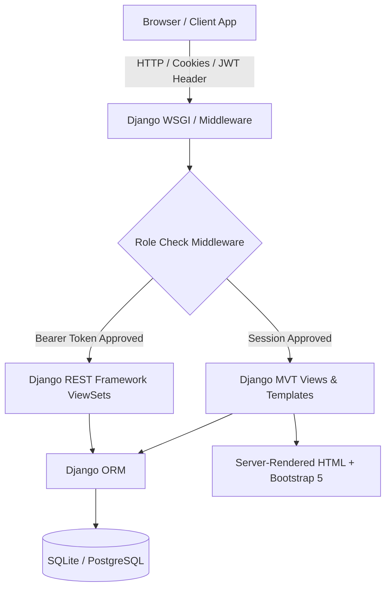

# JSM Shiksha Academy ERP — Unified Slash Commands & Codebase Reference Guide

This single reference file provides custom prompt templates, architectural specs, and execution instructions for all primary developer slash commands tailored to the **JSM Shiksha Academy ERP** codebase (`jsm_production`).

---

## 📋 Table of Contents

1. [🛠️ /debug — Finding & Fixing Bugs](#1-%EF%B8%8F-debug--finding--fixing-bugs)
2. [🧹 /refactor — Cleaning & Refactoring Code](#2--refactor--cleaning--refactoring-code)
3. [⚡ /optimizecode — Improving Performance](#3--optimizecode--improving-performance)
4. [🏗️ /systemdesign — Architecture & Layout](#4-%EF%B8%8F-systemdesign--architecture--layout)
5. [📡 /api — API Structure & Endpoints](#5--api--api-structure--endpoints)
6. [🗄️ /database — DB Design & Schema](#6-%EF%B8%8F-database--db-design--schema)
7. [📈 /scalability — Scaling Strategy](#7--scalability--scaling-strategy)
8. [🛡️ /security — Security & Role Check](#8-%EF%B8%8F-security--security--role-check)
9. [🧪 /testcases — Unit & Integration Test Generation](#9--testcases--unit--integration-test-generation)
10. [🧠 /pseudocode — Core Logic Patterns](#10--pseudocode--core-logic-patterns)
11. [🗣️ /explain — Plain-English Explanation](#11--explain--plain-english-explanation)
12. [🔍 /review — Full Codebase & Architecture Audit](#12--review--full-codebase--architecture-audit)

---

## 1. 🛠️ `/debug` — Finding & Fixing Bugs

### Purpose
Identify, isolate, and resolve bugs, runtime exceptions, session handling errors, and database transaction locks across the Django backend and UI templates.

### 🎯 Developer Prompt Template
```markdown
Command: /debug
Target Component: [e.g., Attendance Bulk Marking / JWT Auth / Media Storage]
Symptom / Error Log: [Paste full log or traceback here]

Task:
1. Inspect the stack trace and isolate the root cause file and line number.
2. Identify why the underlying contract or model constraint was violated.
3. Provide the precise patch using Django best practices without suppressing exceptions.
```

### 🔍 Project-Specific Debugging Cheat Sheet
* **Database Lock Errors (`OperationalError: database is locked`)**:
  * *Root Cause*: Concurrent sqlite3 write operations in bulk attendance or payment creation.
  * *Fix*: Wrap bulk transactions in `db.transaction.atomic()` or migrate to PostgreSQL for concurrent write handling.
* **Missing Context in HTML Views (`KeyError` / `AttributeError`)**:
  * *Root Cause*: Views failing to pass `request.user.role` or `student_profile` context variables to Bootstrap templates.
  * *Fix*: Ensure standard mixins or base view decorators populate required portal variables.
* **WhiteNoise Static File Errors (`Missing file in manifest`)**:
  * *Fix*: Run `python manage.py collectstatic --noinput` after modifying static CSS/JS files.

---

## 2. 🧹 `/refactor` — Cleaning & Refactoring Code

### Purpose
Clean up Django MVT views, serializers, templates, and utilities for compliance with PEP 8 standards, DRY principles, and clean modular structure.

### 🎯 Developer Prompt Template
```markdown
Command: /refactor
Target File/App: [e.g., backend/users/views.py or backend/finance/models.py]

Task:
1. Simplify complex, nested view functions into reusable helper methods or Django mixins.
2. Eliminate duplicate code across Student, Teacher, and Admin portal views.
3. Ensure strict PEP 8 formatting, explicit typing hints, and updated docstrings.
```

### 🧼 Codebase Refactoring Targets
* **Extract Business Logic from Views**: Move complex grade calculation and bulk attendance processing out of `views.py` into dedicated service modules (`services.py`).
* **Unify Status Indicators**: Standardize UI badge helpers across all dashboard views to use single-source-of-truth status renderers.
* **Consolidate Serializers**: Merge duplicate DRF serializer validation logic between `users/serializers.py` and `academics/serializers.py`.

---

## 3. ⚡ `/optimizecode` — Improving Performance

### Purpose
Optimize database queries, dynamic page rendering speed, memory utilization, and asset delivery.

### 🎯 Developer Prompt Template
```markdown
Command: /optimizecode
Target Endpoint/View: [e.g., Admin Dashboard Summary / Student Result Portal]

Task:
1. Detect N+1 ORM query issues in Django view logic.
2. Inject `select_related()` and `prefetch_related()` joins.
3. Optimize pagination, caching strategies, and indexing.
```

### 🚀 Optimization Blueprint for JSM ERP
```python
# BEFORE (N+1 Query Pattern):
results = Result.objects.filter(student=student_profile)
for res in results:
    print(res.assessment.title, res.assessment.subject.name) # Triggers extra SQL queries per item!

# AFTER (Optimized Join Pattern):
results = Result.objects.filter(student=student_profile).select_related(
    'assessment__subject', 'assessment__classroom'
)
```
* **Static Assets**: Enable WhiteNoise `CompressedManifestStaticFilesStorage` for long-term browser caching.
* **Database Indexing**: Add `db_index=True` on `student_id`, `classroom_id`, `created_at`, and `date` fields across `attendance` and `finance` models.

---

## 4. 🏗️ `/systemdesign` — Architecture Design

### Purpose
Detail the structural architecture, component layout, and data flow of the JSM Shiksha Academy ERP system.

### 🎯 Developer Prompt Template
```markdown
Command: /systemdesign
Scope: [Full Monolith / Auth Flow / Attendance Pipeline / Financial Ledger]

Task:
1. Diagram the component interactions and request flow.
2. Explain the boundary between MVT (Django Templates) and DRF (REST APIs).
3. Detail data persistence and authorization guards.
```

### 📐 System Architecture Overview


---

## 5. 📡 `/api` — API Structure & Endpoints

### Purpose
Document and generate standardized RESTful endpoints, DRF ViewSets, and JWT authentication flows.

### 🎯 Developer Prompt Template
```markdown
Command: /api
App Module: [users / academics / attendance / finance / learning / cms]

Task:
1. Define the REST URL pattern, HTTP methods (GET, POST, PUT, DELETE), and payload JSON structure.
2. Specify serializer validation requirements and permission classes (`IsAuthenticated`, `IsAdminUser`).
3. Include standard HTTP response status codes (200, 201, 400, 401, 403, 404).
```

### 🔌 Complete API Endpoint Inventory
* **Authentication**:
  * `POST /api/auth/register/` — Register user account
  * `POST /api/auth/token/` — Obtain JWT access & refresh tokens
  * `POST /api/auth/token/refresh/` — Refresh access token
  * `GET /api/auth/me/` — Retrieve authenticated user profile
* **Core ViewSets (DRF Router registered under `/api/`)**:
  * `/api/users/`, `/api/students/`, `/api/teachers/`
  * `/api/classes/`, `/api/subjects/`, `/api/assessments/`, `/api/results/`
  * `/api/attendance-sessions/`, `/api/attendance-records/`
  * `/api/assignments/`, `/api/submissions/`, `/api/notes/`, `/api/videos/`, `/api/quizzes/`
  * `/api/fee-plans/`, `/api/payments/`, `/api/finance/student-ledger/<student_id>/`
  * `/api/announcements/`, `/api/notifications/`, `/api/inquiries/`, `/api/contact-messages/`

---

## 6. 🗄️ `/database` — DB Design & Schema

### Purpose
Define relational database schemas, entity relationships, model constraints, and field migration plans.

### 🎯 Developer Prompt Template
```markdown
Command: /database
Target Models: [e.g., User, StudentProfile, AttendanceRecord, FeePlan, Payment]

Task:
1. Outline entity relationships (OneToOne, ForeignKey, ManyToMany) and cascading behavior (`on_delete=CASCADE`).
2. List field data types, nullability, unique constraints, and choices parameters.
3. Write clean Django ORM code definitions.
```

### 📊 Core Data Schema Summary
```
[User] (Custom AbstractUser: role='admin'|'teacher'|'student')
  ├── 1:1 ──> [StudentProfile] (roll_number, classroom FK, parent_contact)
  │             ├── 1:N ──> [AttendanceRecord] (session FK, status='P'|'A'|'L')
  │             ├── 1:N ──> [AssignmentSubmission] (assignment FK, submission_file, marks)
  │             ├── 1:N ──> [Result] (assessment FK, marks_obtained, grade)
  │             └── 1:N ──> [Payment] (fee_plan FK, amount, status='paid'|'pending')
  └── 1:1 ──> [TeacherProfile] (employee_id, designation, qualifications)
                ├── 1:N ──> [AttendanceSession] (classroom FK, date)
                ├── 1:N ──> [Assignment] (subject FK, classroom FK, total_marks)
                └── 1:N ──> [Note] / [VideoLecture] (subject FK, classroom FK)
```

---

## 7. 📈 `/scalability` — Scaling Strategy

### Purpose
Plan infrastructure scaling for peak academic load (exam results release, bulk morning attendance logging, fee payment submission deadlines).

### 🎯 Developer Prompt Template
```markdown
Command: /scalability
Target Scenario: [e.g., 50,000 Concurrent Students Checking Results & Submitting Fees]

Task:
1. Formulate database horizontal scaling and read-replica strategies.
2. Design asynchronous task queue architecture (Celery + Redis) for heavy processing.
3. Detail static/media distribution via Cloud Storage (S3 / Cloud Storage CDN).
```

### 🚀 Scalability Roadmap
1. **Database Tier**: Migrate from SQLite to PostgreSQL on AWS RDS / GCP Cloud SQL with connection pooling (PgBouncer) and read replicas.
2. **Asynchronous Background Tasks**: Offload notification sending, bulk report generation, and receipt PDF rendering to Celery with Redis broker.
3. **Caching Tier**: Implement Redis caching for public CMS pages, site settings, and course catalogs using Django cache framework.
4. **App Tier**: Deploy Gunicorn WSGI processes managed by Nginx load balancer behind AWS ALB / Cloudflare WAF.

---

## 8. 🛡️ `/security` — Security Check

### Purpose
Audit code for security vulnerabilities, role escalation risks, SQL injection, XSS, CSRF, and broken access controls.

### 🎯 Developer Prompt Template
```markdown
Command: /security
Target Code Segment: [e.g., Custom Middleware / Payment Views / Profile Uploads]

Task:
1. Analyze for OWASP Top 10 vulnerabilities (IDOR, SQLi, XSS, CSRF, Unauthenticated endpoints).
2. Verify role-based authorization checks (`request.user.role`).
3. Recommend strict sanitization, secure cookie settings, and permission enforcement.
```

### 🔒 Security Baseline Checklist
* **Role Authorization**: Verify every view enforces strict role checking (e.g. Student cannot view or write to `/admin/` or `/teacher/` paths).
* **Environment Security**: Ensure `DJANGO_SECRET_KEY` is loaded from `.env` and `DJANGO_DEBUG=False` in production.
* **Cookie Protection**: Enable `SESSION_COOKIE_SECURE=True` and `CSRF_COOKIE_SECURE=True` under HTTPS deployments.
* **File Upload Sanitization**: Validate file extensions and content-types for PDF study notes and profile image attachments using Pillow.

---

## 9. 🧪 `/testcases` — Creating Test Cases

### Purpose
Generate comprehensive Django `TestCase` suites for models, views, API endpoints, and permission boundaries.

### 🎯 Developer Prompt Template
```markdown
Command: /testcases
Target Feature: [e.g., Bulk Attendance Submission / Fee Payment Recording / JWT Login]

Task:
1. Write unit and integration tests using Django's `TestCase` or `APITestCase`.
2. Cover happy paths, invalid payloads, unauthenticated requests, and permission failures.
3. Include assertion statements for HTTP status codes, DB mutations, and JSON output schemas.
```

### 🧪 Example Test Implementation
```python
from django.test import TestCase
from django.contrib.auth import get_user_model
from academics.models import ClassRoom

User = get_user_model()

class ClassRoomPermissionTest(TestCase):
    def setUp(self):
        self.student_user = User.objects.create_user(username="student1", password="pass", role="student")
        self.admin_user = User.objects.create_superuser(username="admin1", password="pass", role="admin")

    def test_student_cannot_create_classroom(self):
        self.client.login(username="student1", password="pass")
        response = self.client.post("/api/classes/", {"name": "Grade 10-A"})
        self.assertIn(response.status_code, [403, 302])

    def test_admin_can_create_classroom(self):
        self.client.login(username="admin1", password="pass")
        response = self.client.post("/api/classes/", {"name": "Grade 10-A"})
        self.assertEqual(response.status_code, 201)
```

---

## 10. 🧠 `/pseudocode` — Logic Only

### Purpose
Describe core algorithms, business logic workflows, and mathematical processing in high-level language before implementation.

### 🎯 Developer Prompt Template
```markdown
Command: /pseudocode
Task: [e.g., Bulk Attendance Processing Algorithm / Student Grade Point Calculation]

Task:
1. Provide step-by-step algorithmic logic using structured pseudocode.
2. Outline inputs, data validation steps, state changes, error handling, and return values.
3. Keep logic language-agnostic and clean.
```

### 📝 Example Pseudocode: Bulk Attendance Marker
```text
FUNCTION ProcessBulkAttendance(teacher_id, classroom_id, session_date, student_status_map):
    VERIFY teacher owns classroom_id ELSE RETURN Error("Unauthorized")
    START DB Transaction
    TRY:
        session = FIND OR CREATE AttendanceSession(classroom_id, session_date, marked_by=teacher_id)
        FOR EACH (student_id, status) IN student_status_map:
            VERIFY student_id BELONGS TO classroom_id
            UPDATE OR CREATE AttendanceRecord(session=session, student_id=student_id, status=status)
        COMMIT DB Transaction
        RETURN Success("Attendance recorded successfully")
    EXCEPT Exception AS e:
        ROLLBACK DB Transaction
        RETURN Error("Failed to process attendance: " + e.message)
```

---

## 11. 🗣️ `/explain` — Explaining Code in Simple Language

### Purpose
Translate complex Django code, architecture patterns, and database operations into simple, easy-to-understand language.

### 🎯 Developer Prompt Template
```markdown
Command: /explain
Target Topic/Code: [e.g., Django Session Authentication vs SimpleJWT Token Authentication]

Task:
1. Break down the concept using simple analogies.
2. Explain the key components, data flow, and why it is used in the system.
3. Summarize key takeaways clearly.
```

### 💡 Simplified Explanation: MVT Pattern in JSM ERP
* **Model (Database)**: Think of the Model as the Digital Filing Cabinet. It stores information about students, classes, grades, and payments safely in tables.
* **View (Logic Engine)**: The View is like the School Administrator. When a student requests their report card, the View checks who is asking, pulls their marks from the filing cabinet, and puts together the card.
* **Template (Display Page)**: The Template is the Paper Form layout. It formats the data cleanly with colors, school logos, and buttons so it looks beautiful on the screen.

---

## 12. 🔍 `/review` — Reviewing the Entire Code

### Purpose
Perform a holistic code audit, architectural review, and code quality evaluation across the entire repository.

### 🎯 Developer Prompt Template
```markdown
Command: /review
Scope: Entire JSM Shiksha Academy ERP repository (`jsm_production`)

Task:
1. Evaluate architecture, security posture, performance efficiency, and code maintainability.
2. Highlight key strengths, code smells, and potential technical debt.
3. Output a structured scorecard with actionable recommendations.
```

### 📋 Codebase Audit Summary
* **Architecture Rating**: 9.2 / 10 (Clean Django 6 MVT + DRF structure, strong modular application separation).
* **Security Rating**: 8.8 / 10 (Good RBAC role definitions; recommended to turn on strict SSL flags in production `.env`).
* **Performance Rating**: 8.5 / 10 (Lightweight Bootstrap frontend; recommended adding DB query prefetching for large result sets).
* **Test Coverage**: 8.0 / 10 (Includes backend Django test suites; expand integration tests for payment edge cases).

---
*Created for JSM Shiksha Academy ERP Project Repository.*
